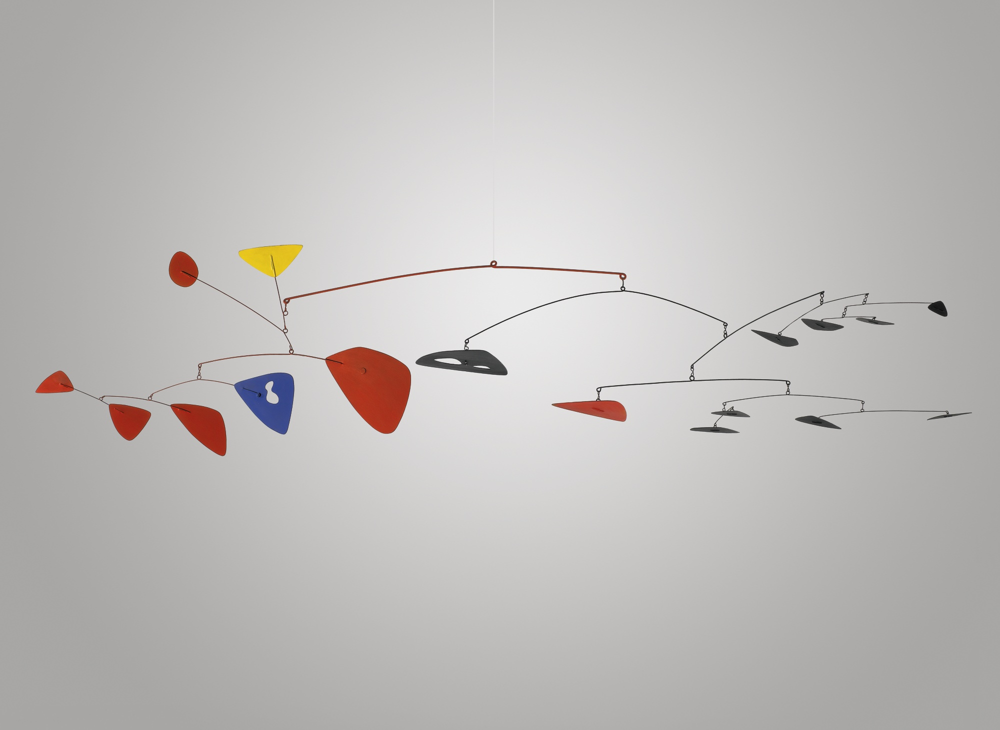

<!--
title: Well-structured HTML with CSS
type: lesson
duration: "1:25"
creator:
    name: Ben Hulan
    city: SF
competencies: HTML and CSS
-->

# Well-structured HTML with CSS

| Objectives |
| :--- |
| Hand-code well-structured HTML documents |
| Understand grid-based HTML structure |
| Write better CSS |
| Debug CSS more quickly |


### Preparation

*Before this lesson, students...*

- ...should have worked through the homework reading from last night, including additional resources, if necessary
- ...should already be able to write HTML and CSS

## CSS Basics Review (Large Group Discussion with Small Group breakouts and Teachback - 30 mins)

Divide the class into groups or invite them to self-identify their level of understanding (fist-to-five). Each group will answer 2 of the following questions with or without notes (depending on instructor discretion) and then present their answers to the class.

Group 1:
Q: What does CSS stand for?
<!-- A: Cascading Style Sheets -->

Q: Explain the difference between an element, a class and an id.
<!-- A: HTML elements include div, h1, p, etc. In CSS an ID must be unique to the page whereas a class can be reused. -->


Group 2:
Q: Describe the concept of specificity and how it is used.
<!-- A: Specificity allows the browser to determine which CSS rule applies to a given element on a page:

* Lower css rules / declarations overwrite higher ones.
* More *specific* selectors beat less specific ones
    * id > class > tag
        * no number of tags can beat a class
        * no number of classes can beat an id
* Inline styles > Internal styles > External styles 
* `!important` trumps all of the above.
-->


Q: What are the three ways to implement CSS styling? which one is best practice and why?
<!-- A: Inline, internal and external style sheets. Inline is worst. Internal uses the HTML <style></style> tag. External offers separation of concerns -->


Group 3:
Q: Explain the Box Model.
<!-- A: HTML elements can have margin, border and padding properties. Margin is the space outside of the element's content. The border is the outer edge of the element. The padding is the space between the content and its border. -->


Q: What values can we use with the 'display' property and what do they do?
<!-- 
Block, Inline, Inline-block and None:

* An **inline** element has no line break before or after it. This makes the element sit on the same line as another element, but without formatting it like a block. It only takes up as much width as it needs (not the whole line). Inline places all your elements on a single line. The bad news is that it doesn't maintain their "box"ness

* A **block** element has some whitespace above and below it and does not tolerate any HTML elements next to it. This makes the element a block box. It won't let anything sit next to it on the page and takes up the full width.

* An **inline-block** element is placed as an inline element (on the same line as adjacent content), but it behaves as a block element. This makes the element a block box but will allow other elements to sit next to it on the same line.

* If you assign **none** as the value of the display, this will make the element and its content disappear from the page entirely!

-->

Group 4:

Q: What is the difference between Absolute, Fixed, Relative and Static positioning?
<!--  A:  
Specifying `position:absolute` _removes the element from the document_ and places it exactly where you tell it to be.

An element with fixed position is positioned relative to the browser window.  It will not move even if the window is scrolled, so a fixed positioned element will stay right where it is creating an effect a bit like the old school "frames" days.

HTML elements are positioned static by default. A `position:static` element is always positioned according to the normal flow of the page and are not affected by the top, bottom, left, and right properties.

Declaring `position:relative` allows you to position the element top, bottom, left, or right relative to where it would normally occur, relative to its parent div or container.
-->


Q: Explain floats and clears.
<!-- A: While floats make other elements aware of their location and get text hugs, clears make other elements aware and are told not to touch. -->


## Another Way to Look at It (5 min):



Many sources compare well-structured HTML to a tree. I tend to think about it more as a top - down architecture, like a mobile.
If you were asked to build this mobile with HTML and CSS, what classes and ID's would you use?
Compare and contrast the mobile and the tree as metaphors for HTML and CSS.


## What is Emmet and how do we use it?

Emmet is a web-developer’s toolkit that can greatly improve your HTML & CSS workflow. It enables the user to create HTML templates really quickly. If you get good at it, you will save a lot of typing!

After installing the plugin, type the following into your text editor one line at a time and press tab.

```
h2.column-title>span#button-set>button*3^p
h2.column-title>ul>li.hello*4^p.caption
h2.column-title>div#calendar>span>button
```

You can do so much more with this, if you want...

[Emmet](http://docs.emmet.io/cheat-sheet/)


## Code with Emmet, Style using Classes and IDs - Independent Practice (10 mins)

Using what we've done in class, open the [project-files emmet-basics.html](project-files/emmet-basics.html) and [project-files / css / emmet-theme.css ](project-files/css/emmet-theme.css) provided and see how far you can get through these exercises in 10 minutes. *Note you will have to link the CSS file first.*

- make an unordered HTML list of the following animals:  
	- mouse  
	- canary  
	- penguin  
	- salmon  
	- cat  
	- goldfish  
	- dog  
	- sheep  
	- parakeet  
	- tuna  

- apply the following colors to the list using IDs:
    - mouse  "color: gray"
    - canary "color: orangered"
    - penguin "color: black"
    - salmon "color: salmon" 
    - cat "color: sienna"
    - goldfish "color: gold"  
    - dog "color: tan"  
    - sheep "color: steelblue"
    - parakeet "color: lime"  
    - tuna "color: purple"

- add the following background colors to your existing classes:
    - mammal - lavenderblush
    - bird - lightgray
    - fish - lightyellow


## More Independent Practice - Using CSS to select class and id attributes (Optional - 10 minutes)

Go back to your code from the previous independent practice problem and continue to work through these exercises:

- make the mammals bold
- make the birds italic
- make the fish underlined

- create a new unordered ordered list add a list item for each the following plants:

    - Dogwood Tree
    - Oak Tree
    - Saguaro
    - Kelp
    - Venus Fly Trap
    - Ent

- give all ul's a border with a width of 3 pixels, a color of plum, and a style of dotted. Also, give them a border radius of 5px.
- give all li's a top border of 3 pixels, a color of seagreen, and a style of solid.


## HTML Grid Architecture and the Ducky Challenge - Independent Practice (30-40 mins)

Modern web developers rarely start from scratch anymore. Many of us use a framework such as Bootstrap, Foundation, Skeleton, Initializr and others. These frameworks take the architectural decision-making out of the process, allowing us to focus on more specific design, interface and development questions.

That said, there's still value in creating your own grid from scratch to solidify some of the most elusive concepts behind writing great HTML and CSS.

Beginning with the [example.html ](project-files/example.html) and [theme.css](project-files/css/theme.css) and then add classes, CSS and content to try to match the example on the screen. *Note: try not to refer to the solutions provided.*


## Conclusion (5 mins)

CSS can be really fun or a total nightmare. You have to remember a few rules, but once you have them remembered, it's great to see your webpage come to life as you imagined.

- What do think about Emmet?
- Identify the popular CSS properities we used today.
