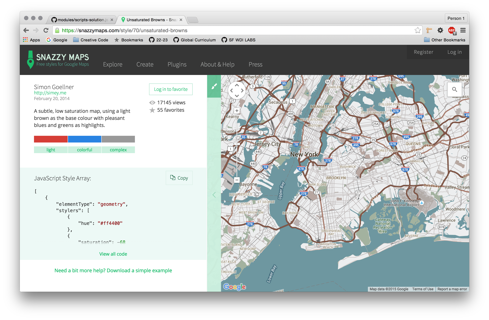

#Google Maps API Homework
The following samples provide a broad overview of some of the most useful features of the Google Maps Javascript API.

For your homework, you have been given a directory of code called 'starter-project'. By default this code points to scripts.js which includes the Javascript for the first example, Simple Map. For each step, the solution is included on index.html, lines 20 - 24. Just un-comment the working scripts to see the results. *NOTE:  Your map styles will be different.*

#### Step 0. Make sure this works!
The most basic map requirements include a map center (latitude and longitude), a zoom level and an id in your HTML where the map will show.

<a href="https://developers.google.com/maps/documentation/javascript/examples/map-simple">Simple Map</a>


#### Step 1. styled maps:
Step 1. Go to SnazzyMaps.com and select a style. Copy the code to your clipboard using the "Copy" button.



Add the array to your code after the zoom level, like so:

```js

map = new google.maps.Map(document.getElementById('map-canvas'), {
    center: {lat: 37.790841, lng: -122.401280},  // General Assembly, SF
    zoom: 13,
    styles: [_____YOUR___ARRAY___HERE___]
});

```

To change the styles, go to Snazzy Maps, pick a style you like, and replace the stylers array in the sample code above. (Be sure to replace the `[ square brackets ]` too) <a href="https://snazzymaps.com/">Styled Maps</a>


#### Step 2. Add a Marker

Create a variable gaMarker and assign a `new google.maps.Marker()` using the code linked below. At minimum you need a `position`, `map` and `title`

<a href="https://developers.google.com/maps/documentation/javascript/examples/marker-simple">Simple Markers</a>


#### Step 3. Simple Marker Icons:
If you have a brand, you probably want to make custom icons.

Here's the General Assembly icon:


Create a variable to store a string pointing to your icon. (It should be "ga_cog.png")
Add an attribute `icon` to your Marker object and assign the variable storing the string.

<a href="https://developers.google.com/maps/documentation/javascript/examples/icon-simple">Simple Marker Icons</a>


#### STRETCH Challenge (Optional):

#### Step 4. Add an Info Window & Event Listener
An `InfoWindow` is a popup window on Google Maps. The content of the window is stored in an html string. (This will not display without the event listener.)

Create a variable, 'contentString' and assign a reasonable html string describing General Assembly. Feel free to use any valid HTML and make sure to wrap it in quotes.

```js
'<h2>General Assembly</h2>' +
'<p>Description goes here</p>';
```

Add an infoWindow using the code linked below:

<a href="https://developers.google.com/maps/documentation/javascript/examples/infowindow-simple">InfoWindows</a>

Finally, grab the code from the same link to call .addListener();

```js

    _____.addListener('click', function() {
        infowindow.open(map, _____);
    });

```


