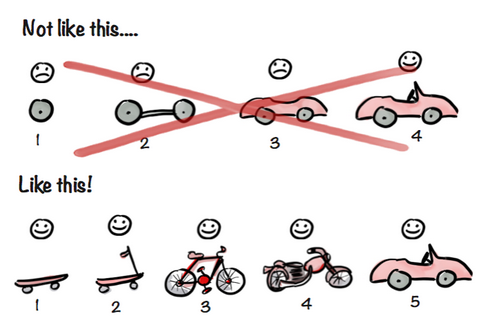

# Homework: Project 1 Planning

This document will give you a little more guidance about the project 1 planning requirements and how to approach them.  Reference the [Project 1 README](https://github.com/sf-wdi-22-23/modules/tree/master/w04-associations-and-auth/project-1) for the other requirements.

## Getting Ideas

Think about problems you know of - things that suck or are broken in the world.

Could you build something that could grow into a solution? Try to make a focused app that does one thing well.

Examples of applications that do one thing well:
- [Question Cookie](http://www.questioncookie.com/) - allows fast voting moderation
- Facebook Messenger - allows easy communication between individuals or groups
- Twitter - lets people share their thoughts quickly
- [Maps with Friends](https://maps-with-friends.herokuapp.com/) - lets you track friends by putting markers on a map

Here are some student projects from past cohorts:

* Bedford - http://ootd-demo.herokuapp.com/
* Katie - https://culturejam.herokuapp.com/
* Erin  - https://digital-darkroom.herokuapp.com/
* Rolando - https://reddit-news-stream.herokuapp.com/
* Freel - https://henryfreel-top-5.herokuapp.com/
* Manu - https://startupwdi.herokuapp.com/  `<- this one is a project idea generator`
    * Manu - after he refactored for 3 weeks  - http://startupninja.herokuapp.com/
* Esben - https://flofl.herokuapp.com/ 
* Henry - https://hashmere.herokuapp.com/
* Sabastian - https://extraterrestrial-excape.herokuapp.com
* Arif - https://gitnaughty.herokuapp.com/
* Paul - http://belayme.herokuapp.com/
* Aileen - https://justice-for-us.herokuapp.com/
* Ian - http://sound-bites.herokuapp.com/
* Katie - https://culturejam.herokuapp.com/
* Rob - https://merch-connect.herokuapp.com/

## Planning Requirements

### User stories

Outline your core user stories and divide them into clear, smaller steps (sometimes called development "stories"). For example, this user story:

*As a user, I want to create a profile for my dog*

Might consist of these steps:

- Wireframe what a profile page will look like
- Create an EJS template for a profile page
- Write a server route to serve the profile page
- Create a schema for a dog, defining desired attributes, e.g., name, age, favorite chew toy, etc.
- create a page / form / route to create a new user in database
- Serve profile page populated with information from database

Use your own Trello board to track your progress and keep you focused. Make each card a user story, and mark it with a time estimate. You can make the steps for that user story into a checklist on the card (or individual cards, if you prefer).  For a more accurate estimate, double the time you think it will take.

Add comments to your cards as you progress and complete features – by the end of your project you'll have a living log of 'gotchas' you debugged and things you learned about the process of developing an app iteratively.

### Wireframes

Sketch out the pages of your app. What will they look like? How they will work, both on page-load and when affected by jQuery?

The more time you spend on this step, the easier it will be to structure your HTML. Well-structured HTML will make it easier to implement your CSS, to manipulate the DOM, and to figure out what routes you need to get data for the page.

### Object Models

Use an entity relationship diagram to plan out the Models and any relationship(s) among them.  In your diagram, write out the properties for your schemas. Include:

* Will your application have many models or only a few?
* How will they interact with each other?
* What attributes (properties) will they have, and what kind of data types (string, integer, collection, etc.) will they use?

### Scope

Software development is about managing complexity. It's easy for code to become a tangled web of tightly coupled functions or data structures ([callback hell](http://callbackhell.com/), anyone?) if you aren't diligent and vigilant in your decision making.

The same applies to the scope of your project. If you're always looking at the top of the mountain, you will trip on the rocks in front of you.

Figure out the absolutely smallest thing you can do, and do that thing. Not the next immediate thing, but the simplest possible implementation of your app. If that means that the entire functionality of your app consists of logging in, displaying all of a user's photos from their Instagram account, saving a favorite photo url to the database, and logging out, that is totally great.

Don't think so? Check out the [requirements](https://github.com/sf-wdi-22-23/modules/tree/master/w04-associations-and-auth/project-1). It's all there: your own Node/Express API serving EJS templates to your client, user and photo models associated with each other, AJAX, an external API call, authentication, and so on.

See? You did it!

**Example Scope**

My app (using the Google Maps API) will allow users to add markers to a map, displaying a friend's name and city in a sidebar. My stretch goal is to move the sidebar info into individual info-windows on each marker that display when clicked.

To help break out your scope, you'll want milestones.

### Milestones

Milestones provide checkpoints for the progress of your app – they give you a way to check in with yourself about how much headway you've made.

Listing each feature reminds you what is done or pending, and makes it convenient for estimating the number of hours/days for a feature.

*Note: each milestone will likely be made of several user stories, and contain elements of the technical requirements.*

**Example Milestones**

- [ ] project planning complete (wireframes, user stories, etc.)
- [ ] Hello World achieved
- [ ] Save and render data from database using a form
- [ ] authentication (sign up, log in, logout) working
- [ ] API call to <External API HERE> being saved in/served from database
- [ ] client styling (CSS) complete
- [ ] app deployed to Heroku

### Feasibility

Before you get started, you'll want to do some research to see if what you're looking to do is possible. Some areas that you might want to investigate, depending on your app's desired functionality are:

- Reading documentation to see what data you can request from your API of choice. Is it JSON? XML? Is all the information you want included in the response? Will you need to make several different requests to the API?
- Verifying that you can successfully request data from your API using [Postman](https://chrome.google.com/webstore/detail/postman-rest-client/fdmmgilgnpjigdojojpjoooidkmcomcm?hl=en) or [cURL](http://conqueringthecommandline.com/book/curl#cid23)
- Researching something you want to use that hasn't been taught in class yet, like an external module/library, data store, etc.

**Example Feasibility**

- [ ] Read Yelp API documentation
- [ ] Use Postman to test Twilio API
- [ ] Research using Handlebars.js client-side templating

## Outside-in Development

Outside-in development says you should start with the "outside" of your app - the views that the user sees, and move backwards to the server, then the database. Don't try to develop the whole front end of your app before moving on, but for each user story, page, or feature, you can follow the outside-in pattern.

Start with the basics of your view:

- [ ] an index.html file with static data directly in the file
- [ ] create a template based on the structure in the html
- [ ] use the template to display dynamic data from a temporary array on the client
- [ ] move the data to a temporary array on the server and get it with a GET call to a route on the server
- [ ] move the data to your database

Once you have an index page populated with data from the database, you can move to other views or features. Your data is already in the database, but try to follow an outside-in process to:
- [ ] make a route for a show page (a page for a specific instance of a model)
- [ ] make a button that allows you to delete a specific instance of a model
- [ ] add a page where you can edit your model (or do it on the show page with AJAX)

## Conclusion

Have fun and ask questions!

## Submission

You will submit all of your planning requirements in person to an instructor on Thursday morning. Please create physical (or electronic) documents for each item; projects will not be approved without instructors reviewing these. 
