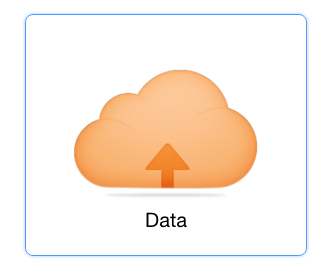
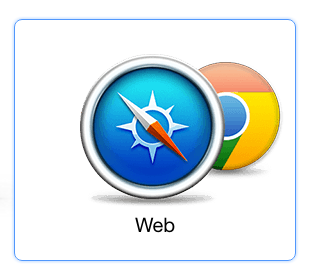

# Parse - Backend as a Service

Owned by Facebook, Parse is a cloud app platform that enables users to add a scalable and powerful backend to launch a full-featured app.

### Setup Back-end
1. Signup for [Parse](parse.com)
1. Select the "Data" product

  

1. Select the "Web" environment

  

1. Then click "Start using the dashboard"
1. The "Core" tab at the top is where you can view your data.

YAY your backend is set up! Wasn't that easy?

### Setup Front-end
You may use any front-end you already have or you can make a new one. I'm going to assume that it's Angular.

1. In `index.html`, include a link to the parse js:
  ```html
  <script src="http://www.parsecdn.com/js/parse-1.6.7.min.js"></script>
  ```

1. In `app.js`, include a `run` block that initializes your Parse application. In Angular, `run` blocks get run before all other code.
  ```js
  app.run(function() {
    Parse.initialize("add-your-parse-application-Id","add-you-parse-javascript-key");
  });
  ```

1. Now you're ready to `get/post/put/patch/delete` from your Parse backend. To create and post your first object, add this code to a controller:
  ```js
  // Simple syntax to create a new subclass of Parse.Object.
  var Post = Parse.Object.extend("Post");
  // Create a new instance of that class.
  var post = new Post();
  // Save the new instance
  post.save({title: "This is a new post"}, {
    success: function(newPost) {
      // Execute any logic that should take place after the object is saved.
      alert('New object created with objectId: ' + newPost.id);
    },
    error: function(newPost, error) {
      // Execute any logic that should take place if the save fails.
      // error is a Parse.Error with an error code and message.
      alert('Failed to create new object, with error code: ' + error.message);
    }
  });
  ```

1. Open your client-side app in a browser window using the file system.
1. Now go back to your Parse dashboard to see your new class and data!

## Challenge
Create a fullstack Angular/Parse app CRUDing whatever resource you'd like. Could be fun to swap out your backend from your weekend project with a Parse backend. Consult the [Parse js docs](https://www.parse.com/docs/js/guide) (the 'Objects' section has info for how to `get/post/put/patch/delete`) and the [quick reference](https://www.parse.com/docs/rest/guide) for the rest API.

## Stretch Challenge
CRUD two resources and create a relationship between them.
